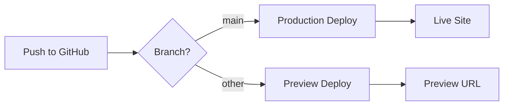

## Overview

Vercel is the recommended platform for deploying Maymoun's Portfolio. It provides automatic deployments, preview environments, and optimized Next.js hosting.

<Note>
  Vercel is created by the team behind Next.js and offers the best performance and developer experience for Next.js applications.
</Note>

## Quick Deploy

Deploy your portfolio in minutes:

<Steps>
  <Step title="Import Repository">
    Click the button below or visit [vercel.com/new](https://vercel.com/new) and import your GitHub repository:
    
    [](https://vercel.com/new/clone?repository-url=https://github.com/Amalou99/melfahim-portfolio)
  </Step>
  
  <Step title="Configure Project">
    Vercel auto-detects Next.js. Verify these settings:
    
    - **Framework Preset**: Next.js
    - **Build Command**: `npm run build`
    - **Output Directory**: `.next`
    - **Install Command**: `npm install`
  </Step>
  
  <Step title="Add Environment Variables">
    Configure required environment variables (see below)
  </Step>
  
  <Step title="Deploy">
    Click "Deploy" and wait for the build to complete
  </Step>
</Steps>

## GitHub Integration

### Connect Repository

Vercel automatically integrates with GitHub:

1. **Authorize Vercel**: Grant access to your GitHub repositories
2. **Select Repository**: Choose your portfolio repository
3. **Configure Deployments**: Set up production and preview branches

### Automatic Deployments

Vercel automatically deploys:

- **Production**: Pushes to `main` branch
- **Preview**: Pull requests and other branches
- **Rollback**: Instant rollback to previous deployments



<Warning>
  Ensure your repository is public or you have a Vercel Pro account for private repositories.
</Warning>

## Environment Variables Configuration

Configure environment variables in the Vercel dashboard:

### Setting Variables

<Steps>
  <Step title="Navigate to Settings">
    Go to your project → Settings → Environment Variables
  </Step>
  
  <Step title="Add Variables">
    Add each variable with appropriate environment scope:
    
    - **Production**: Live site only
    - **Preview**: Pull request deployments
    - **Development**: Local development (optional)
  </Step>
  
  <Step title="Redeploy">
    Trigger a new deployment to apply changes
  </Step>
</Steps>

### Required Variables

<CodeGroup>
```bash Analytics
# Umami Analytics
NEXT_UMAMI_ID=your-umami-website-id
```

```bash Comments (Giscus)
# Visit https://giscus.app to get your IDs
NEXT_PUBLIC_GISCUS_REPO=username/repo
NEXT_PUBLIC_GISCUS_REPOSITORY_ID=R_kgDOxxxxxxx
NEXT_PUBLIC_GISCUS_CATEGORY=Announcements
NEXT_PUBLIC_GISCUS_CATEGORY_ID=DIC_kwDOxxxxxxx
```

```bash Newsletter (Optional)
# Buttondown (default)
BUTTONDOWN_API_KEY=your-api-key

# Or Mailchimp
MAILCHIMP_API_KEY=your-api-key
MAILCHIMP_API_SERVER=us1
MAILCHIMP_AUDIENCE_ID=your-audience-id

# Or ConvertKit
CONVERTKIT_API_KEY=your-api-key
CONVERTKIT_FORM_ID=123456
```
</CodeGroup>

### Variable Scopes

| Variable | Production | Preview | Development |
|----------|-----------|---------|-------------|
| `NEXT_UMAMI_ID` | ✅ Required | ⚠️ Optional | ❌ Not needed |
| `NEXT_PUBLIC_GISCUS_*` | ✅ Required | ✅ Required | ✅ Required |
| Newsletter API Keys | ✅ Required | ❌ Not needed | ❌ Not needed |

<Tip>
  Use different Giscus repositories for production and preview to separate comments.
</Tip>

## Custom Domain Setup

### Add Domain

<Steps>
  <Step title="Navigate to Domains">
    Project Settings → Domains
  </Step>
  
  <Step title="Add Domain">
    Enter your custom domain (e.g., `maymoun.dev`)
  </Step>
  
  <Step title="Configure DNS">
    Add DNS records at your domain registrar:
    
    ```dns
    # For apex domain (maymoun.dev)
    A Record: 76.76.21.21
    
    # For www subdomain
    CNAME Record: cname.vercel-dns.com
    ```
  </Step>
  
  <Step title="Verify & Enable SSL">
    Vercel automatically provisions SSL certificates via Let's Encrypt
  </Step>
</Steps>

### Domain Configuration

```javascript data/siteMetadata.js
const siteMetadata = {
  siteUrl: 'https://your-domain.com', // Update this!
  siteRepo: 'https://github.com/yourusername/your-repo',
  // ... other settings
}
```

<Warning>
  After adding a custom domain, update `siteUrl` in `data/siteMetadata.js` and redeploy for RSS feeds and metadata to use the correct URL.
</Warning>

## Analytics Integration

### Umami Analytics Setup

<Steps>
  <Step title="Create Umami Account">
    Sign up at [umami.is](https://umami.is) or self-host
  </Step>
  
  <Step title="Add Website">
    Create a new website in your Umami dashboard
  </Step>
  
  <Step title="Get Website ID">
    Copy the website ID from Settings → Websites
  </Step>
  
  <Step title="Add to Vercel">
    Add `NEXT_UMAMI_ID` environment variable in Vercel
  </Step>
  
  <Step title="Verify Installation">
    Deploy and check Umami dashboard for tracking events
  </Step>
</Steps>

### Configured in Site Metadata

```javascript data/siteMetadata.js
analytics: {
  umamiAnalytics: {
    umamiWebsiteId: process.env.NEXT_UMAMI_ID,
  },
}
```

### Alternative Analytics Providers

The portfolio supports multiple analytics providers:

<Tabs>
  <Tab title="Google Analytics">
    ```javascript
    analytics: {
      googleAnalytics: {
        googleAnalyticsId: 'G-XXXXXXXXXX',
      },
    }
    ```
    
    Don't forget to update CSP in `next.config.js`:
    ```javascript
    script-src 'self' 'unsafe-eval' 'unsafe-inline' www.googletagmanager.com
    ```
  </Tab>
  
  <Tab title="Plausible">
    ```javascript
    analytics: {
      plausibleAnalytics: {
        plausibleDataDomain: 'your-domain.com',
      },
    }
    ```
  </Tab>
  
  <Tab title="PostHog">
    ```javascript
    analytics: {
      posthogAnalytics: {
        posthogProjectApiKey: 'phc_xxxxxxxxxx',
      },
    }
    ```
  </Tab>
</Tabs>

## Build & Deployment Settings

### Build Configuration

Vercel automatically detects the build configuration:

```json vercel.json (auto-generated)
{
  "buildCommand": "npm run build",
  "devCommand": "npm run dev",
  "installCommand": "npm install",
  "framework": "nextjs",
  "outputDirectory": ".next"
}
```

### Build Settings Override

Customize in Project Settings → General:

<Tabs>
  <Tab title="Build Command">
    ```bash
    npm run build
    ```
    Runs the production build with post-build RSS generation
  </Tab>
  
  <Tab title="Output Directory">
    ```bash
    .next
    ```
    Next.js build output directory
  </Tab>
  
  <Tab title="Install Command">
    ```bash
    npm install
    # or
    yarn install
    ```
  </Tab>
  
  <Tab title="Node Version">
    ```bash
    18.x
    ```
    Recommended: Node.js 18 or later
  </Tab>
</Tabs>

### Performance Optimizations

Vercel automatically enables:

- **Edge Network**: CDN distribution across 100+ locations
- **Image Optimization**: Automatic WebP/AVIF conversion
- **Smart Compression**: Brotli and Gzip compression
- **HTTP/2 & HTTP/3**: Modern protocol support
- **Incremental Static Regeneration**: Dynamic content updates

## Deployment Workflow

### Production Deployment

```bash
# Commit changes
git add .
git commit -m "Update portfolio content"

# Push to main branch
git push origin main

# Vercel automatically:
# 1. Detects push
# 2. Runs build
# 3. Deploys to production
# 4. Updates live site
```

### Preview Deployments

Every pull request gets a preview URL:

```bash
# Create feature branch
git checkout -b feature/new-blog-post

# Make changes and push
git push origin feature/new-blog-post

# Create pull request on GitHub
# Vercel comments with preview URL
```

### Deployment Logs

Monitor deployments in real-time:

1. Go to Vercel Dashboard → Deployments
2. Click on any deployment
3. View build logs, runtime logs, and analytics

## Advanced Configuration

### Custom Headers

The portfolio includes security headers in `next.config.js`:

```javascript
const securityHeaders = [
  {
    key: 'Content-Security-Policy',
    value: ContentSecurityPolicy.replace(/\n/g, ''),
  },
  {
    key: 'X-Frame-Options',
    value: 'DENY',
  },
  {
    key: 'X-Content-Type-Options',
    value: 'nosniff',
  },
  {
    key: 'Strict-Transport-Security',
    value: 'max-age=31536000; includeSubDomains',
  },
]
```

### Redirects and Rewrites

Add redirects in `next.config.js`:

```javascript
async redirects() {
  return [
    {
      source: '/old-blog/:slug',
      destination: '/blog/:slug',
      permanent: true,
    },
  ]
}
```

### Edge Functions

For dynamic routes requiring server-side logic, use Edge Functions:

```javascript
export const config = {
  runtime: 'edge',
}

export default function handler(req) {
  return new Response('Hello from Edge!')
}
```

## Monitoring & Debugging

### Real-time Logs

Access logs via Vercel CLI:

```bash
# Install Vercel CLI
npm i -g vercel

# Login
vercel login

# View logs
vercel logs
```

### Performance Monitoring

Vercel Analytics provides:

- **Core Web Vitals**: LCP, FID, CLS metrics
- **Real User Monitoring**: Actual user experience
- **Geographic Performance**: Performance by region

Enable in Project Settings → Analytics

### Error Tracking

Integrate error tracking services:

<CardGroup cols={2}>
  <Card title="Sentry" icon="bug">
    Add `@sentry/nextjs` for error monitoring
  </Card>
  
  <Card title="LogRocket" icon="video">
    Session replay and error tracking
  </Card>
</CardGroup>

## Troubleshooting

<AccordionGroup>
  <Accordion title="Build fails with 'Module not found'">
    **Solution**: Check that all dependencies are in `package.json`:
    
    ```bash
    npm install
    npm run build
    ```
    
    If it works locally but fails on Vercel, clear the build cache in Project Settings.
  </Accordion>
  
  <Accordion title="Environment variables not working">
    **Solution**: 
    1. Verify variable names start with `NEXT_PUBLIC_` for client-side access
    2. Check the variable is set for the correct environment (Production/Preview)
    3. Redeploy after adding new variables
  </Accordion>
  
  <Accordion title="Images not loading">
    **Solution**: Add image domains to `next.config.js`:
    
    ```javascript
    images: {
      domains: ['your-image-cdn.com', 'example.com'],
    }
    ```
  </Accordion>
  
  <Accordion title="RSS feeds not generated">
    **Solution**: Ensure post-build script runs successfully:
    
    ```bash
    # Check build logs for:
    "RSS feed generated..."
    
    # Verify siteMetadata.js has correct siteUrl
    ```
  </Accordion>
</AccordionGroup>

## Next Steps

<CardGroup cols={2}>
  <Card title="Build Process" icon="hammer" href="/deployment/build">
    Understand the build process and optimization strategies
  </Card>
  
  <Card title="Content Management" icon="pen" href="/customization/content-management">
    Learn how to create and manage blog posts
  </Card>
  
  <Card title="Configuration" icon="gear" href="/customization/configuration">
    Configure site settings and features
  </Card>
  
  <Card title="Styling" icon="palette" href="/customization/styling">
    Customize your portfolio's appearance
  </Card>
</CardGroup>
